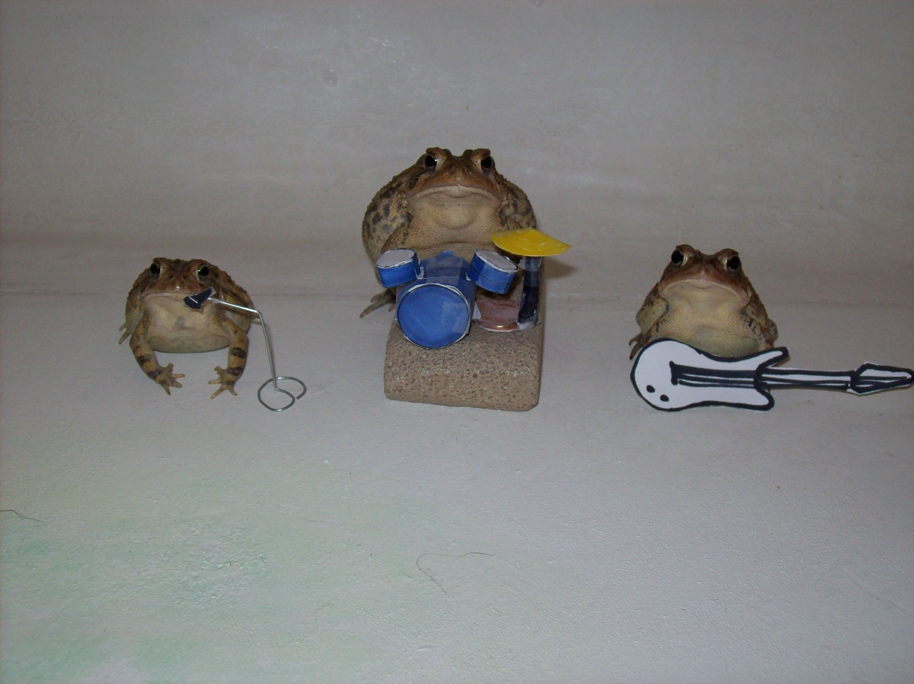
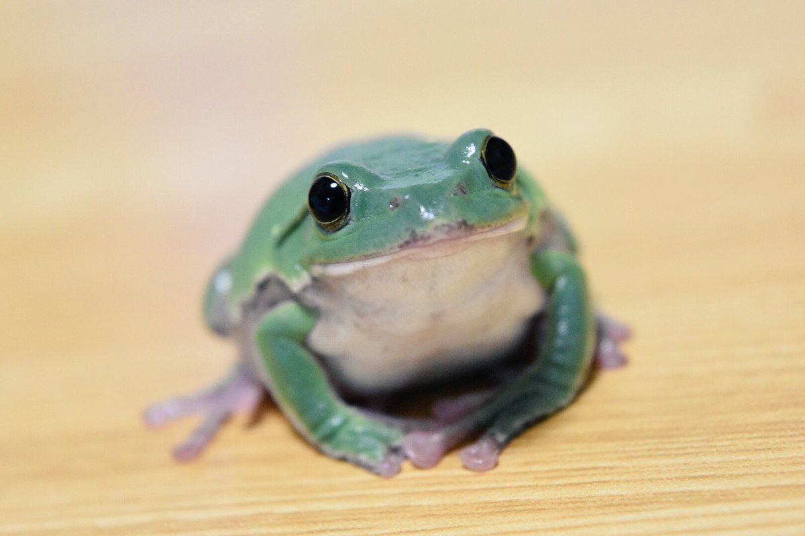

# API for frog and toad images

### It's wednesday my dudes!

A service that allows you to get a random image of a frog or toad

## Api

### Auth
* GET `/auth/singup` - registration page. Enter your name, email and password to register an account
* POST `/auth/singup` - submit registration data.

### Frog api
* `/api/v1/generateToken` - generates a new token for the user and returns it. Requires basic authentication with an email address as user and password
* `/api/v1/{token}/frog` - returns a random frog or toad image. Requires token

## "It's wednesday my dudes!" mode

If the current day is wednesday `/api/v1/{token}/frog` returns an image with the text "it's wednesday my dudes"

## Images

Images are stored in the [image folder](images). When starting the service in S3, previously unloaded images are loaded. Next, the service works with the S3 storage

### Examples 



## Configuration

You have to provide configuration for postgres database and S3 storage:

```yaml
spring:
    url:
    username:
    password:
minio:
  endpoint:
  accessKey:
  secretKey:
  bucket:
  autoCreation: true
```

Additional properties you can see in [application.yml](src/main/resources/application.yml)
## Build and run
### Dockerfile

1. Run `docker build -t vitekkor/frog-api-service:latest .` to build docker image 
2. Run docker image:
```shell
docker run --name frog-api-service -p 8080:8080 \
-v path/to/custom/application.yml:/etc/vitekkor/frogapi/application.yml -d \
vitekkor/frog-api-service:latest
```

### Docker compose

You can use docker compose to build and run service

#### Configuration

1. Set database password ```POSTGRES_PASSWORD:```
2. Set minio credentials
```yaml
MINIO_ROOT_USER:
MINIO_ROOT_PASSWORD:
```
3. Set up volumes (optional)
4. Run `docker-compose up -d`
